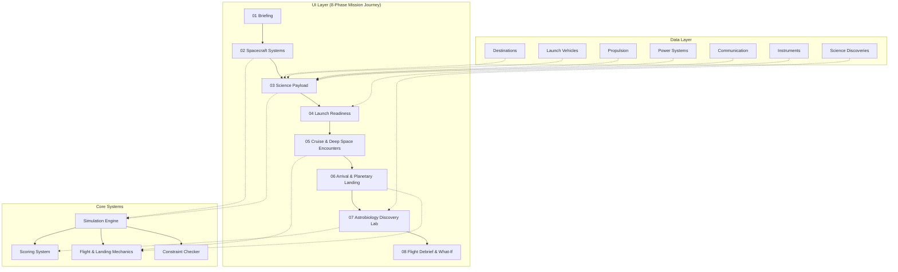

# 🚀 MISSION FORGE

> **NASA Space Apps Challenge 2026 — Team MathaiBlock (ম্যাথাইব্লক)**

[](https://react.dev/)
[](https://www.typescriptlang.org/)
[](https://vitejs.dev/)
[](https://tailwindcss.com/)
[](https://threejs.org/)

---

## 🎯 মিশন (The Mission)

**MISSION FORGE** — একটি ইন্টারঅ্যাক্টিভ স্পেস-মিশন ডিজাইন ও সিমুলেশন গেম যেখানে আপনি হবেন **মিশন ডিরেক্টর**। বাস্তব ইঞ্জিনিয়ারিং কনস্ট্রেইন্টস — মাস, পাওয়ার, ফুয়েল, বাজেট, রিলায়েবিলিটি — এর মধ্যে একটি ডিপ-স্পেস সায়েন্টিফিক মিশন ডিজাইন করুন, তারপর লঞ্চ করুন এবং অজানা চ্যালেঞ্জগুলো mater করুন।

> **Every mission is a trade-off.**  
> **প্রতিটি মিশন একটি ট্রেড-অফ।**

---

## 🎮 লাইভ ডেমো চালান

```bash
# রিপোজিটরি ক্লোন করুন
git clone https://github.com/Mahbub0001/Nasa_Space_App_Challenge.git
cd Nasa_Space_App_Challenge

# ডিপেন্ডেন্সি ইনস্টল করুন
npm install

# ডেভেলপমেন্ট সার্ভার চালু করুন
npm run dev
```

তারপর ব্রাউজারে `http://localhost:3000` খুলুন।

---

## 🏗️ আর্কিটেকচার ওভারভিউ



---

## ✨ কী ফিচারগুলো আছে

| ফিচার | বর্ণনা |
|---------|-------------|
| 🎨 **প্রিমিয়াম অ্যারospace UI** | মিশন-কন্ট্রোল এস্থেটিক, IBM Plex Mono টাইপোগ্রাফি |
| 🚀 **পূর্ণ মিশন লাইফসাইকেল** | Brief → Design → Launch → Simulate → Arrive → Review |
| ⚖️ **রিয়েল-টাইম ট্রেড-অফ** | স্পেসক্রাফ্ট কনফিগার করার সাথে সাথে লাইভ টেলিমেটری আপডেট |
| 🎲 **ডিটার্মিনিস্টিক ইভেন্টস** | কোর্স ডেভিয়েশন, পাওয়ার এনোমালি, কমস উইন্ডো |
| 📊 **মাল্টি-অ্যাক্সিস স্কোরিং** | সায়েন্স, রিলায়েবিলিটি, ইফিশিয়েন্সি, বাজেট, ডাটা রিটার্ন |
| 🔄 **What-If অ্যানালাইসিস** | আপনার মিশনকে অল্টারনেটিভ কনফিগারেশনের সাথে তুলনা |
| 🎬 **সিনেমাটিক লঞ্চ** | T-10 কাউন্টডাউন সহ স্টেজড ইгнаিশন সিকোয়েন্স |
| 🛰️ **ডাইনামিক স্পেসক্রাফ্ট** | SVG-ভিত্তিক ভিজ্যুয়ালাইজেশন যা আপনার চয়েস অনুযায়ী বদলায় |

---

## 🎮 গেমপ্লে ওকথ্রু (পর্ব অনুযায়ী)

### পর্ব ১: দ برিফিং (The Briefing)
প্রজেক্ট অরোরার উদ্দেশ্য পান — ১৮ দিনের লঞ্চ উইন্ডো, $২.৪বি বাজেট, ৪,৫০০ কেজি মাস লিমিট।

### পর্ব ২: মিশন কন্ট্রোল (Mission Control)
আপনার স্পেসক্রাফ্ট কনফিগার করুন:
- **ডেস্টিনেশন**: লুনার орবিট / মার্স / অ্যাস্টারয়েড বেল্ট
- **লঞ্চ ভহিকল**: মিডিয়াম / হেভি / হেভি+ লিফট
- **প্রপালশন**: কেমিকেল / ইলেকট্রিক / হাইব্রিড
- **পাওয়ার**: সোলার / অ্যাডভান্সড সোলার / লং-ডিউরেশন
- **কমস**: স্ট্যান্ডার্ড / হাই-গেইন / ডিপ-স্পেস

### পর্ব ৩: সায়েন্টিফিক পেয়লোড (Scientific Payload)
ইন্সট্রুমেন্ট সিলেক্ট করুন — প্রতিটা সায়েন্স ভ্যালু বাড়ায় কিন্তু মাস, পাওয়ার, বাজেট নেয়:
- 🔬 **Spectrometer** (+১৮ Science, +১২০kg, +১২ Power)
- 📡 **Radar** (+২২ Science, +১৮০kg, +১৮ Power)
- 📷 **Imaging System** (+১৪ Science, +৮০kg, +৮ Power)
- ☢️ **Radiation Detector** (+১০ Science, +৪০kg, +৫ Power)
- 🌡️ **Atmospheric Sensor** (+১৬ Science, +৭০kg, +৯ Power)

### পর্ব ৪: রিডিনেস চেক (Readiness Check)
সभी কনস্ট্রেইন্টসের অটোমেটেড ভ্যালিডেশন। লাল ইন্ডিকেটর দেখাবে ঠিক কীtover।

### পর্ব ৫: লঞ্চ ও সিমুলেশন (Launch & Simulation)
সিনেমাটিক লঞ্চ → অরবিটাল ট্রাজেক্টরি → **৩টি ক্রিটিক্যাল মিশন ইভেন্ট** যেখানে আপনার ডিসিশন লাগবে।

### পর্ব ৬: মিশন রিভিউ (Mission Review)
ফাইনাল স্কোর ব্রেকডাউন + নैरেটিভ ইনসাইট + **What-If** কমপैरিজন।

---

## 🛠️ টেক স্ট্যাক

```
Frontend:     React 18 + TypeScript + Vite
Styling:      Tailwind CSS + কাস্টম ডিজাইন সিস্টেম
3D/Canvas:    Three.js + SVG/Canvas 2D
Icons:        Lucide React
Fonts:        Inter Variable + IBM Plex Mono
Testing:      Node.js নেটিভ টেস্ট রানার
```

---

## 📁 প্রজেক্ট স্ট্রাকচার

```
src/
├── components/
│   ├── common/           # Button, Badge, AerospaceCard, Modal
│   ├── layout/           # Header, Footer, Layout wrapper
│   ├── mission/          # ReadinessAudit, ConfigSelector, EventModal
│   ├── instruments/      # PayloadManager, InstrumentCard
│   ├── spacecraft/       # SpacecraftVisualizer, Spacecraft3DCanvas
│   ├── simulation/       # TrajectoryCanvas, LaunchScene, FlightScene
│   ├── narrative/        # FlightCommsHUD, AnimatedGuide
│   └── telemetry/        # TelemetryPanel, TelemetryGauge
├── screens/
│   ├── Landing/
│   ├── Briefing/
│   ├── MissionControl/
│   ├── Payload/
│   ├── Readiness/
│   ├── Launch/
│   ├── Simulation/
│   ├── Results/
│   └── WhatIf/
├── simulation/
│   ├── engine.ts         # কোর ডিটার্মিনিস্টিক সিমুলেশন
│   ├── scoring.ts        # মাল্টি-অ্যাক্সিস স্কোরিং অ্যালগরিদম
│   ├── constraints.ts    # কনস্ট্রেইন্ট ভ্যালিডেশন
│   └── eventResolver.ts  # মিশন ইভেন্ট আউटकাম
├── data/                 # সব গেম কনফিগারেশন ডাটা
├── types/                # স্ট্রিক্ট TypeScript ইন্টারফেস
├── hooks/                # useMission, useSimulation
└── utils/                # formatting, calculations
```

---

## 🧪 টেস্টিং

```bash
# স্পেসক্রাফ্ট মডেল টেস্ট চালান
npm run test:spacecraft

# সব গেম লজিক টেস্ট চালান
npm run test:game
```

---

## 🏁 জাজদের জন্য ডেমো পাথ

NASA Space Apps শর্টলিস্ট ভিডিওর জন্য এই পাথ ফলো করুন:

1. **Landing** → `START MISSION` ক্লিক করুন
2. **Briefing** → `ENTER MISSION CONTROL` ক্লিক করুন
3. **Mission Control** → সিলেক্ট করুন:
   - Destination: **Mars**
   - Launch: **Heavy Lift**
   - Propulsion: **Hybrid**
   - Power: **Advanced Solar**
   - Comms: **Deep-Space**
4. **Payload** → যোগ করুন: **Imaging + Spectrometer + Radar + Radiation Detector**
5. **নിരীক্ষণ করুন** ট্রেড-অফ মোমেন্ট (Science↑, Mass↑, Power↑, Risk↑)
6. **Readiness** → `INITIATE LAUNCH` ক্লিক করুন
7. **Launch** → সিনেমাটিক সিকোয়েন্স দেখুন
8. **Simulation** → ৩টি ইভেন্টে ডিসিশন নিন
9. **Results** → স্কোর + What-If অ্যানালাইসিস দেখুন

---

## 🔬 সায়েন্টিফিক ইন্টিগ্রিটি

> **MISSION FORGE is a conceptual simulation prototype.** The current demo uses fictionalized game parameters inspired by real aerospace engineering constraints. Official NASA/partner datasets and challenge-specific resources will be integrated in the final hackathon version.

এই প্রজেক্ট **"Science First"** প্রিন্সিপাল ফলো করে — সব মেকানিক্স বাস্তব অ্যারospace কনসেপ্ট থেকে অনুপ্রাণিত (Tsiolkovsky rocket equation, পাওয়ার বাজেট, লিংক বাজেট, মাস ফ্র্যাকশন) কিন্তু গেমপ্লে ক্লারিটির জন্য সিম্পলিফাইড।

---

## 👥 Team MathaiBlock (ম্যাথাইব্লক)

| ভূমিকা | সদস্য |
|------|--------|
| মিশন ডিরেক্টর (লিড) | [আপনার নাম] |
| ফ্লাইট ডাইনামিক্স | [সহযোগী] |
| সিস্টেম্স ইঞ্জিনিয়ারিং | [সহযোগী] |
| সায়েন্স অপারেশনস | [সহযোগী] |
| UX/ভিজ্যুয়াল ডিজাইন | [সহযোগী] |

---

## 📜 লাইসেন্স

MIT License — NASA Space Apps Challenge 2026-এর জন্য নির্মিত

---

## 🌟 স্বীকৃতি

- NASA — Space Apps Challenge প্ল্যাটফর্মের জন্য
- ওপেন-সোর্স কমিউনিটি — React, Three.js, Tailwind, Lucide-এর জন্য
- অ্যারospace ইঞ্জিনিয়াররা — বাস্তব কনস্ট্রেইন্টস অনুপ্রেরণা দেওয়ার জন্য

---

<div align="center">

**DESIGN. DECIDE. EXPLORE.**

*Every mission is a trade-off.*  
*প্রতিটি মিশন একটি ট্রেড-অফ।*

**Made with ❤️ by Team MathaiBlock**

</div>