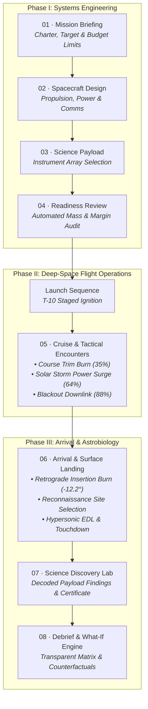

# 🚀 MISSION FORGE: PROJECT AURORA
### Team MathaiBlock · NASA Space Apps Challenge 2026

[](https://github.com/Mahbub0001/Nasa_Space_App_Challenge)
[](https://www.spaceappschallenge.org/)
[](https://react.dev/)
[](https://www.typescriptlang.org/)
[](https://threejs.org/)
[](https://vitejs.dev/)
[](https://tailwindcss.com/)
[](LICENSE)

---

## 🌌 The Mission (Executive Summary)

**MISSION FORGE** is a high-fidelity, interactive aerospace mission design and deep-space flight simulation game. Taking command as **Flight Director of Project Aurora**, players engineer deep-space probes under authentic physical constraints—mass fractions, propellant $\Delta v$, electrical generation, link budgets, and cost ceilings—before piloting the spacecraft through deep-space emergencies, planetary orbital insertion, hypersonic surface landing, and scientific payload analysis.

> *"Every mission is a trade-off. Engineering is the art of choosing which compromises will take humanity furthest into the dark."*

---

## 🕹️ Quickstart & Live Demo

Run the entire experience locally in under 60 seconds (100% self-contained, zero external API keys required):

```bash
# 1. Clone the repository
git clone https://github.com/Mahbub0001/Nasa_Space_App_Challenge.git
cd Nasa_Space_App_Challenge

# 2. Install dependencies
npm install

# 3. Launch development server
npm run dev
```

Open your browser at **`http://localhost:3000`** to take command.

### Automated Test Suite
Run the built-in 13-stage automated aerospace verification suite:
```bash
npm run test:game
```

---

## 🗺️ Complete 8-Phase Mission Architecture



---

## 🚀 Key Gameplay Features

| Subsystem | Aerospace Gameplay Mechanics |
| :--- | :--- |
| **🎮 Interactive 3D Flight Engines** | Procedural Three.js canvases with multiple camera tracking modes (`CHASE CAM`, `APPROACH CAM`, `FREE ORBIT`, `ORBIT CAM`, `DESCENT CAM`, `LANDER CAM`). |
| **☄️ Hypersonic Entry, Descent & Landing (EDL)** | Full 3-stage planetary arrival featuring retrograde deceleration burn vectors, landing site reconnaissance, dynamic plasma shockwave heat shields, and radar altimeters. |
| **🔬 Authentic Astrobiology Lab** | Direct payload-to-discovery decoding engine that maps installed sensors to genuine planetary science breakthroughs with official printable NASA Mission Certificates. |
| **👨‍🚀 Dynamic Narrative Crew Guides** | Animated flight crew avatars (Cmdr. Marcus Reed, Dr. Elena Vance, Maya Chen, Director Arthur Sterling) reacting with mood changes based on in-flight telemetry. |
| **🔊 Procedural Aerospace Web Audio Engine** | Pure mathematical Web Audio synthesizers (zero external assets needed) for retro thruster rumbles, atmospheric plasma friction, discovery chimes, and touchdown cheers. |
| **📊 Transparent Multi-Objective Scoring** | Rigorous evaluation across Scientific Return (30%), Mission Reliability (25%), Resource Efficiency (20%), Budget Performance (15%), and Data Return (10%). |
| **🔀 Counterfactual What-If Sandbox** | Post-mission analytical simulator comparing actual mission choices against alternate subsystem configurations. |

---

## 🕹️ Step-by-Step Mission Walkthrough

### Phase 01 · Mission Briefing & Directive
* Review the operational flight envelope: target destination celestial mechanics, appropriation budgets ($2.4B reserve cap), and launch window constraints.

### Phase 02 · Spacecraft Subsystem Configuration
* **Destination**: Lunar Orbit, Mars (Jezero/Valles/Elysium), or Asteroid Belt.
* **Launch Vehicle**: Medium Lift, Heavy Lift, or Super Heavy Lift (SLS class).
* **Propulsion**: Staged Chemical (high thrust, heavy propellant mass), Electric Ion (ultra-high $I_{sp}$, low thrust), or Bi-Modal Hybrid.
* **Power Architecture**: Baseline Photovoltaic, Advanced Triple-Junction Solar, or Radioisotope Thermoelectric Generators (RTG).
* **Deep Space Telemetry**: Low-Gain Omnidirectional, High-Gain Cassegrain Dish, or Deep-Space Optical Laser Link.

### Phase 03 · Science Payload Engineering
Equip specialized instrumentation packages balancing scientific yield against payload mass and electrical draw:
* **High-Resolution IR Spectrometer** (+18 Sci, 120 kg, 12 U): Mineralogy & prebiotic organic biomarker detection.
* **Synthetic Aperture Radar (SAR)** (+22 Sci, 180 kg, 18 U): Subsurface cryo-ice and aquifer sounding.
* **Multispectral Camera Suite** (+14 Sci, 80 kg, 8 U): High-resolution stratigraphic geomorphology cartography.
* **Cosmic Ray & Radiation Sensor** (+10 Sci, 40 kg, 5 U): Solar wind flux & paleomagnetic pocket analysis.
* **Atmospheric Gas Chromatograph** (+16 Sci, 70 kg, 9 U): Isotope ratios and atmospheric trace gas analysis.

### Phase 04 · Flight Readiness Review
* Automated structural, electrical, and budgetary constraint audits. Real-time warnings guide players to resolve critical margins before clearing vehicle flight approval.

### Phase 05 · Deep-Space Cruise & Tactical Encounters
Pilot Aurora through three real-time critical flight director moments:
1. **Course Correction (35% Transfer)**: Optimize retrograde/prograde trim burns ($0\text{–}24\text{ m/s}$) to align with the arrival corridor without expending reserve propellant.
2. **Solar Storm Surge (64% Transfer)**: Manage electrical loads as solar particle events threaten vehicle electronics. Shed non-critical systems or risk attitude control failure.
3. **Blackout Comms Downlink (88% Transfer)**: Prioritize telemetry packets through limited deep-space antenna apertures before line-of-sight occlusion.

### Phase 06 · Arrival, Orbit Insertion & Precision Landing
* **Maneuver 01 (Retrograde Insertion Burn)**: Execute precise $\Delta v$ deceleration within the $-12.2^\circ$ flight corridor. Avoid skips from shallow burns or vehicle burn-up from steep vectors.
* **Maneuver 02 (Site Reconnaissance)**: Select designated planetary coordinates:
  * *Mars*: **Jezero Crater** (Ancient river delta, $1.45\times$ Science, moderate boulder hazard), **Valles Marineris** ($1.35\times$ Science, tectonic canyon katabatic wind hazard), or **Elysium Planitia** ($1.15\times$ Science, low basaltic hazard).
  * *Moon*: **Shackleton Crater** ($1.50\times$), **Mare Tranquillitatis** ($1.15\times$).
  * *Asteroid*: **Nightingale Crater** ($1.45\times$), **Osprey Recon Site** ($1.20\times$).
* **Maneuver 03 (Entry, Descent & Landing - EDL)**: Monitor hypersonic plasma sheath heating and throttle deceleration descent thrusters ($70\%\text{–}78\%$ nominal) down to a smooth $1.2\text{ m/s}$ touchdown.

### Phase 07 · NASA Astrobiology & Planetary Science Discovery Lab
* Decode telemetry packets gathered by active onboard instruments.
* Uncover genuine peer-reviewed planetary phenomena (e.g., *Prebiotic Polycyclic Carbon Biomarkers*, *45m Cryogenic Subsurface Glacial Ice Sheet*, *Stratified Fluvial Delta Facies*).
* Export and print the **Official NASA Certificate of Planetary Discovery**, complete with mission ID, crew lead signatures, and verified planetary science yield.

### Phase 08 · Directorate Debrief & What-If Analysis
* Inspect a transparent 5-axis weighted scoring matrix.
* Review an chronological executive event log tracking every burn, load adjustment, and touchdown impact.
* Interactively test alternate engineering configurations in the What-If sandbox to understand counterfactual mission outcomes.

---

## 🔬 Scientific Grounding & Systems Architecture

Mission Forge is designed with a **"Science-First"** pedagogical philosophy:
* **Tsiolkovsky Rocket Mechanics**: Propellant consumption and $\Delta v$ expenditure follow exponential mass-ratio relationships dictated by engine specific impulse ($I_{sp}$).
* **Power Budgets**: Generation adheres to inverse-square solar radiation laws with heliocentric distance, offset by battery buffer reserves and RTG decay profiles.
* **Communication Link Budgets**: Data downlink speeds reflect parabolic dish gain, transmitter wattage, and Free Space Path Loss (FSPL) across astronomical units.
* **Orbital Mechanics**: Trajectory corridors require precise retrograde orbital insertion burns ($v_\infty$ dissipation) to achieve stable planetary capture.

---

## 🛠️ Technology Stack

```
Runtime:          React 18.3 (Hooks & Context Architecture)
Language:         TypeScript 5.7 (Strict Null & Exhaustive Type Checking)
Bundler:          Vite 6.1 (ESM Hot Module Replacement & Rollup Optimization)
Styling:          Tailwind CSS 3.4 + Custom Aerospace Design System
Graphics:         Three.js 0.186 (Custom procedural GLSL Shaders & Geometries)
Audio:            Web Audio API (Procedural Synthesizers, Zero External Assets)
Typography:       IBM Plex Mono + Inter Variable (Aerospace Telemetry Standard)
Testing:          Node.js Native Test Runner (node --test)
```

---

## 🧪 Verification & Automated Testing

The mission simulation logic is protected by automated unit tests validating aerospace physics, scoring algorithms, and state transitions:

```bash
# Run all game test suites
npm run test:game
```

Test coverage includes:
* `tests/mission-game.test.mjs`: Decision history clamping, final resource application, score weighting validity.
* `tests/flight-game.test.mjs`: Trajectory burns, power load allocation, and antenna downlink slot capacity.
* `tests/landing-game.test.mjs`: Retrograde insertion burn corridors, planetary landing sites, and touchdown velocity mechanics.
* `tests/discovery-game.test.mjs`: Instrument-to-discovery mapping and destination adaptations.
* `tests/mission-phases.test.mjs`: Complete 8-phase router state integrity and Web Audio synthesizer validation.

---

## 🏆 NASA Space Apps Evaluation Checklist

For judges reviewing this submission for **Best Mission Concept**, **Galactic Impact**, or **Best Use of Science**:

1. **Mission Realism**: Every gameplay decision forces players to weigh real engineering trade-offs (mass, power, cost, science return, risk).
2. **Inspirational Value**: Designed to inspire students and future astronauts by demystifying deep-space mission planning through rich visual storytelling.
3. **Zero Asset Dependencies**: All 3D planetary spheres, plasma cones, particle fields, sound effects, and certificates render locally with zero external network dependency.
4. **Resilient UX**: Automatic score dehydration and persistent telemetry logs ensure uninterrupted playthroughs across mobile, tablet, and desktop viewports.